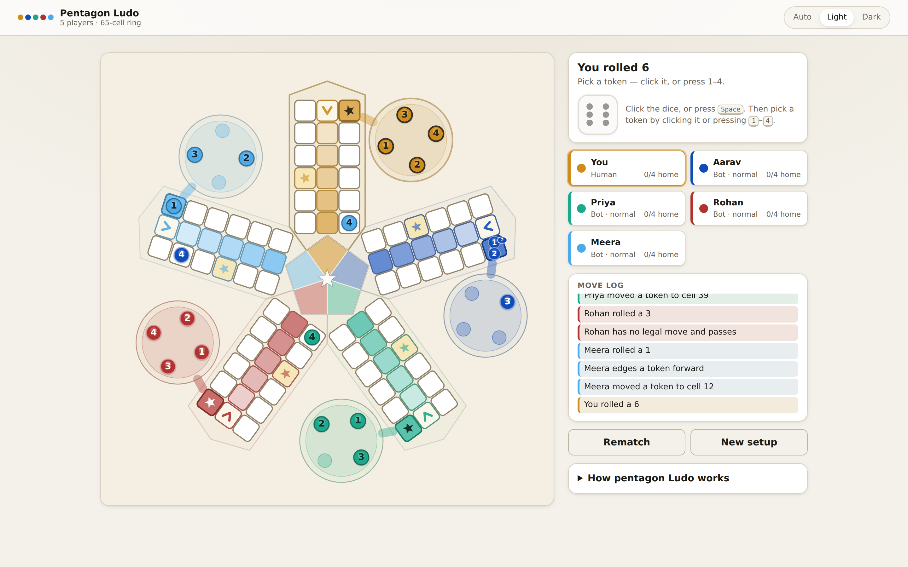
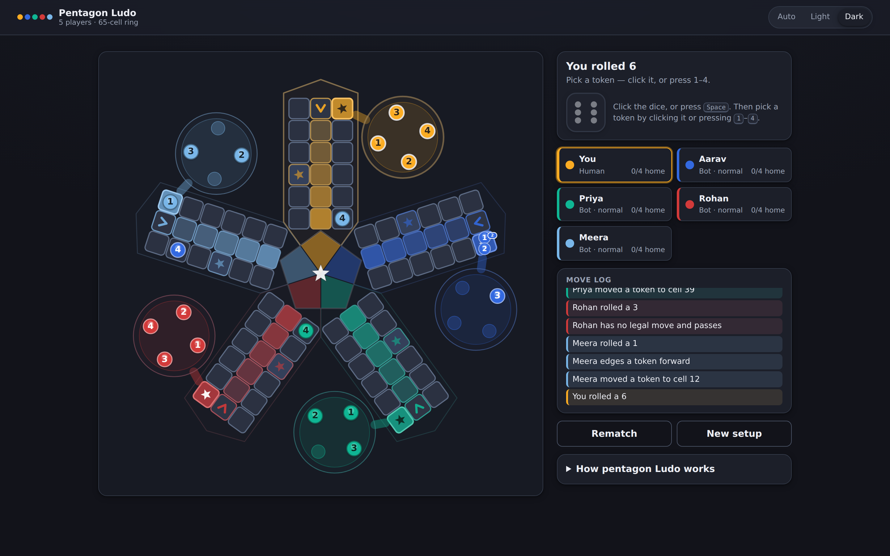
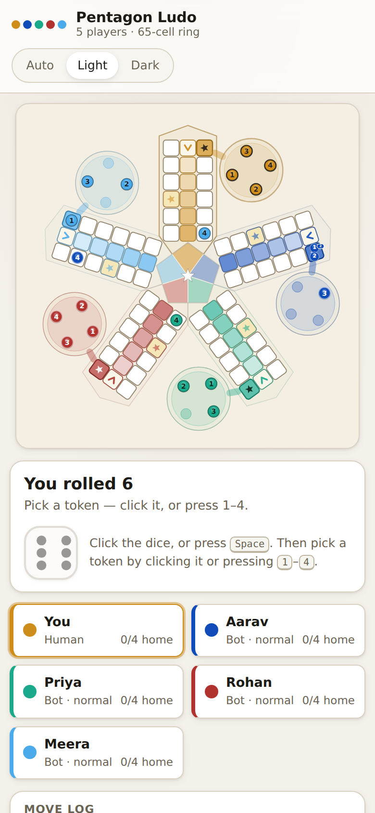

# Pentagon Ludo — 5 Player Edition

A five-player Ludo game that runs in the browser with **no build step, no npm
packages and no network assets**. Everything is plain ES modules, one stylesheet
and an inline SVG board. Open it from a static server and play: one human seat
and four bots by default, or any mix of humans and bots across the five seats.

- Zero dependencies, zero tooling. `git clone`, `node ludo/serve.mjs`, play.
- A pure rules engine (`js/engine.js`) with a plain-JSON state, so games
  serialize, resume from `localStorage`, and are fully testable head-less.
- Deterministic: the dice come from a seeded mulberry32 stream, so the same seed
  and the same moves replay the same game.


## What it looks like



The five arms each carry a white outward track column, a tip cell with a chevron
pointing into that arm's home column, and an inward column that hands over to the
next arm — 65 ring cells in one continuous loop. Each arm is a solid 6 × 3 block
with the tip level with its two neighbours. Start cells are saturated and
starred, the ten safe squares are pale gold, and each home column runs the full
inner length of the arm, docking straight onto the goal pentagon in the centre.

The five seats are **Amber**, **Cobalt**, **Jade**, **Crimson** and **Sky**.
Neighbours are separated by lightness as well as hue, so they stay apart under
deuteranopia and protanopia (worst pair ΔE76 ≥ 30 in both themes — a test in
`test/geometry.test.mjs` enforces it, and the same test pins `geometry.COLORS` to
the `--p0 … --p4` custom properties so code and stylesheet cannot drift). Under
*tritanopia* Jade and Sky do converge; hue alone cannot separate five seats
across all three types, and each token also carries its number.

| Dark theme | Phone (390px) |
|---|---|
|  |  |

---

## The board: why five arms and 65 cells

Classic Ludo has 4 arms of 13 track cells = 52 ring cells. Pentagon Ludo keeps
the arm exactly as it is and adds a fifth one:

```
5 arms x 13 cells = 65 ring cells        (constant RING)
5 home-column cells per player           (constant HOME_COLUMN)
progress 0..64 ring, 65..69 home, 70 goal (constant HOME_STEP)
```

Arm `i` owns ring indices `13i .. 13i+12` and is rotated `-90deg + i*72deg`
about the board centre, so the five arms sit at the points of a pentagon. In an
arm's local frame `u` runs outward along the arm axis and `v` runs across it:

```
                                 arm i, drawn with the board CENTRE on the left
                                 and the arm TIP on the right

                 ┌───────┬───────┬───────┬───────┬───────┬───────┐
  v = -w    ╱    │ 13i+0 │ 13i+1 │ 13i+2★│ 13i+3 │ 13i+4 │ 13i+5 │
  v =  0  goal◄  │  h4   │  h3   │  h2   │  h1   │  h0   │13i+6 ▲│  tip
  v = +w    ╲    │13i+12 │13i+11 │13i+10 │ 13i+9 │ 13i+8 │13i+7 ★│
                 └───────┴───────┴───────┴───────┴───────┴───────┘
                    u1      u2      u3      u4      u5      u6

  ★ = safe cell        h0..h4 = player i's home column (5 cells)
  13i+7  = startIndex(i), where player i's tokens enter the ring (also safe)
  13i+6  = entryIndex(i), the tip; the last ring cell before the home column
  13i+2  = the "star" safe cell, 8 steps ahead of arm (i-1)'s start cell
  goal   = the shared centre pentagon — not a cell; the block docks onto its vertex
```

An arm is a solid **6 × 3 block**: six radial rows `u1 … u6`, all three columns
occupied in every one of them, no gaps. In board units (cell edge = 46) the rows
sit at `u = 123.85, 173.53, 223.21, 272.89, 322.57, 372.25`.

* **Outward column** `13i+0 … 13i+5` sits at `v = -w`, running from `u1` (nearest
  the centre) out to `u6`.
* **Tip** `13i+6` sits on the axis at `u6` — the same outermost row as `13i+5`
  and `13i+7`. It caps the middle column; it does not stand outside the block.
  The chevron drawn on it points inward, into the home column.
* **Inward column** `13i+7 … 13i+12` sits at `v = +w`, running back from `u6` in
  to `u1`. Cell `13i+12` at `u1` neighbours cell `13(i+1)+0` of the next arm, so
  the ring closes: … 63, 64, 0, 1 … with no seam.
* **Home column** is the arm's middle row (`v = 0`, `u5` in to `u1`): five cells
  that only player `i` may enter. The innermost one, `h4` at `u1`, docks straight
  onto the goal pentagon's vertex — `GOAL_R = 2.10 cells = 96.60` against an
  inner cell edge of `100.85`, a **4.25-unit gutter**, the same order as the
  3.68 units between two ordinary cells. So the home run flows into the goal
  wedge with no empty slot in the block and no bare corridor in front of it.
* **Base**: each player's four (or two, or three) unplayed tokens park in a disc
  beside their start cell.

### How a lap works

A token of player `p` enters the ring at `startIndex(p) = 13p + 7` — the outer
end of its own arm's inward column — walks **inward**, crosses onto the next
arm's outward column, out to that arm's tip, and repeats. After 64 steps it
arrives at `entryIndex(p) = 13p + 6`, its own tip, having visited all 65 ring
cells exactly once. The next steps turn into the home column (`h0` … `h4`) and
then the goal.

### Safe squares

Ten cells are safe — two per arm: `13k+2` and `13k+7` for `k = 0…4`, i.e.

```
2, 7, 15, 20, 28, 33, 41, 46, 54, 59
```

`13k+7` is player `k`'s start cell. The other one, `13k+2`, is the classic
"star": counting forwards from the start of the *previous* arm, `13(k-1)+7 + 8
= 13k+2`, so every player meets a star eight steps after setting off.

**No capture ever happens on a safe cell** — tokens of different players simply
share it. Tips are *not* safe.

---

## Rules

**Turn order** is 0 → 1 → 2 → 3 → 4 → 0 …, skipping players who have already
finished.

1. **Rolling.** On your turn you roll one die (1–6). If you have no legal move,
   the turn passes.
2. **Leaving base.** A token can only leave base on a **6**, and it lands on its
   own start cell (`startIndex(p)`, progress `t = 0`).
3. **Moving.** A token on the track advances by the die value. Its progress `t`
   may never exceed **70**: you need the *exact* roll to reach the goal, and an
   overshoot is simply not a legal move.
4. **Home column.** Progress 65–69 are the five home-column cells, which only
   the owner can enter. Progress 70 is the goal.
5. **Capture.** Landing on a ring cell that is **not safe** sends *every*
   opponent token on that cell back to base. Your own tokens are never captured
   and may stack freely.
6. **Blocks** (on by default). Two or more tokens of the *same* player on one
   ring cell form a block: opponents may neither land on it **nor pass through
   it**. The owner passes and lands on their own block freely. Home-column cells
   are never blocks. Note the consequence: while blocks are on you can never
   capture two tokens of one player at once, because you could not land there.
7. **Extra turns.** You roll again after a 6, after a capture, and after sending
   a token to the goal. An extra turn keeps the turn with you.
8. **Three sixes.** A third consecutive 6 forfeits the turn immediately: no move
   is offered, the streak resets and play moves on. (This overrides the extra
   turn a 6 would otherwise give.)
9. **Finishing.** A player whose every token has reached the goal is finished
   and takes the next rank; the first finisher is the **winner**. Finished
   players are skipped. When only one player is still racing the game is over
   and that player takes the last rank.

All of 5, 6, 7 and 8 are toggles in the engine (`DEFAULT_RULES`); the setup
screen exposes the three that change play the most.

---

## Running it

The game is plain static files, but it uses ES modules, so it must be served
over HTTP (`file://` will not load the modules).

```sh
node ludo/serve.mjs          # -> Pentagon Ludo on http://localhost:8080/
node ludo/serve.mjs 3000     # any port; PORT=3000 also works
```

Then open the printed URL. `serve.mjs` is ~80 lines of `node:http` with no
dependencies: correct MIME types (including `.mjs` and `.js` as
`text/javascript`), `404` for missing files, `405` for anything but GET/HEAD,
and `403` for any request path containing a `..` segment — it will not serve a
single byte from outside the `ludo/` directory.

### Tests

```sh
node --test "ludo/test/*.test.mjs"
```

61 tests, no dependencies, importing the real modules by relative path. They
cover the board geometry (ring closure and the 64 → 0 wrap, cell spacing,
viewBox containment, the safe-cell set, every progress regime for all five
players, the six-row arm grid with no empty middle-column slot, the innermost
home cell docking the goal pentagon's vertex, no goal-wedge/cell overlap, and
four tokens fitting inside a goal wedge), the seat palette (deuteranopia and
protanopia separation in both themes, 4.5:1 ink contrast, and exact agreement
with `css/styles.css`), the rules engine (exit on six, exact roll to goal, capture and
no-capture-on-safe, blocks landing and passing, three-sixes forfeit, extra
turns, rank order, game over, immutability, serialize round-trip, and seeded
full games that must terminate), and the bot (picks a supplied move, prefers a
goal, prefers a capture, deterministic, never throws).

> `node --test ludo/test` — passing the *directory* — is the documented Node
> form, but it fails on some Node 22 builds (including the one this was
> developed against, v22.22.2, where it tries to `require` the directory).
> The glob form above works everywhere.

### Browser accessibility smoke check

```sh
NODE_PATH=$(npm root -g) node ludo/test/browser-a11y.mjs
```

`test/browser-a11y.mjs` drives a real Chromium through Playwright, so it is
deliberately **not** named `*.test.mjs` and `node --test` never picks it up. It
starts `serve.mjs` on a free port itself, prints a per-check pass/fail summary
and exits non-zero on failure. It covers the roving tabindex and arrow-key
roving, token roles and `aria-disabled`, the spoken reason for every rejected
pick, results-dialog focus, and four kinds of corrupt save being discarded
without a dead screen. It needs Playwright and Chromium installed **globally**;
the app itself stays dependency-free and no-build.

---

## Module layout

| File | Imports | Responsibility |
| --- | --- | --- |
| `index.html` | — | Markup, setup screen, game screen, module bootstrap |
| `css/styles.css` | — | All styling, light + dark, player colours `--p0 … --p4` |
| `js/geometry.js` | nothing | Pure board maths: constants, `startIndex`/`entryIndex`, `isSafe`, `progressToCell`, `cellCenter`, `baseSlot`, and the fully pre-computed `layout` |
| `js/engine.js` | geometry | Pure rules: `createGame`, `rollDice`, `legalMoves`, `applyMove`, `passTurn`, `standings`, `serialize`/`deserialize`, `makeRng`. Never mutates the state it is given |
| `js/ai.js` | geometry | `chooseMove(state, moves, level)` and `describeChoice(move)`; deterministic, seeded off the state |
| `js/render.js` | geometry | Draws the SVG board and tokens, animates moves and captures, and owns the board's roving tabindex, token roles and labels |
| `js/ui.js` | all | Wires engine ↔ renderer ↔ DOM: screens, turn flow, dice, log, persistence |
| `serve.mjs` | node builtins | The static server above |
| `test/*.test.mjs` | the real modules | `node --test` suites |
| `test/browser-a11y.mjs` | Playwright (global) | Manual browser smoke check; not run by `node --test` |

The state is plain JSON — no classes, no functions — so it can be cloned,
stored and compared. The engine returns `{state, events}`; the events
(`move`, `capture`, `goal`, `finish`, `extraTurn`, `turn`, `gameOver`) are what
the UI animates.

---

## Controls

| Input | Action |
| --- | --- |
| **Space** or **Enter** | Roll the dice (or confirm the focused token when one is selected) |
| **1 … 4** | Play that token of the player to move (`1 … 2` or `1 … 3` in a shorter game) |
| **Click / tap** a token | Play that token — movable tokens are highlighted |
| **Click** the dice button | Roll |
| **Tab** / **Shift-Tab** | Move between the board, the dice and the panel controls. The board holds a single tab stop (the last token you touched); during a pick every *movable* token is a stop |
| **Arrow keys**, **Home**, **End** | Move focus from token to token on the board (Home/End jump to the first/last) |
| **Esc** | Close the results dialog |

Keys are ignored while a text input or select has focus, and a focused button
keeps its own Space/Enter. Everything else is answered: a polite `aria-live`
region announces each roll, move and turn change, and **every rejected pick says
why** — "Token 3 is in base — you need a 6.", "It's Aarav's turn — wait for the
bot.", "There is no token 5 — press 1–4." — by key, by click and by tap alike.

The board uses a roving tabindex, so Tab enters it once rather than walking all
twenty tokens; arrows move within it. When a pick opens, focus moves to the first
movable token, and after the move it returns to the dice.

## Settings

Everything below lives on the setup screen and is applied when you press
**Start game**:

- **Seats 1–5** — a name each, Human or Bot, and for a bot a level of
  *easy* (mostly random), *normal* (the heuristic with a little noise) or
  *hard* (greedy with a one-ply retaliation check). The default is seat 1 as a
  human called "You" and four bots.
- **Tokens per player** — 2, 3 or 4 (default 4). Fewer tokens makes for a much
  shorter game.
- **Rules** — *Blocks*, *Extra turn on capture*, *Three sixes forfeit the turn*,
  all on by default.
- **Seed** — the integer that seeds the dice. Same seed plus same moves equals
  the same game; there is a randomise button next to the field.
- **Theme** — Auto / Light / Dark in the header, remembered in `localStorage`.
  Auto follows `prefers-color-scheme`.

The game in progress is saved to `localStorage` after each move, and the setup
screen offers **Resume game** when a saved game is found. The move log inside the
state keeps only its last 200 entries, so the save stays a few kilobytes however
long the game runs. Every storage access is wrapped in `try/catch`, so
private-mode browsers simply lose persistence rather than breaking — and a save
that is corrupt or from an incompatible build is discarded with a visible notice
instead of leaving a dead screen.
